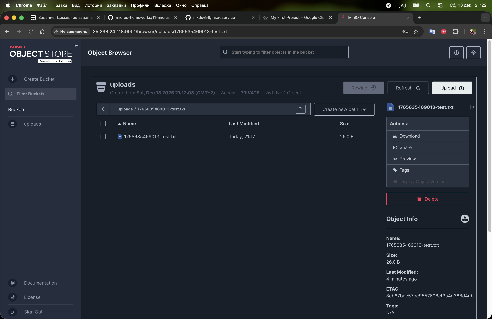

# Домашнее задание: Микросервисы: принципы

## Задача 1: API Gateway

### Сравнительная таблица решений API Gateway

| Решение | Маршрутизация | Аутентификация | HTTPS терминация | Производительность | Простота настройки | Open Source |
|---------|--------------|----------------|------------------|-------------------|-------------------|-------------|
| **Kong** | ✅ Гибкая на основе плагинов | ✅ JWT, OAuth2, Basic Auth, LDAP | ✅ Встроенная | Высокая (OpenResty/nginx) | Средняя | ✅ |
| **Traefik** | ✅ Автоматическая из конфигурации | ✅ BasicAuth, DigestAuth, ForwardAuth | ✅ Let's Encrypt интеграция | Высокая | Высокая | ✅ |
| **NGINX Plus** | ✅ Продвинутая | ✅ JWT, OAuth2 | ✅ Встроенная | Очень высокая | Средняя | ❌ Платный |
| **Amazon API Gateway** | ✅ На основе правил | ✅ IAM, Cognito, Lambda authorizers | ✅ Автоматическая | Высокая | Высокая | ❌ SaaS |
| **Envoy** | ✅ Динамическая | ✅ Через фильтры | ✅ Встроенная | Очень высокая | Низкая | ✅ |
| **Tyk** | ✅ На основе политик | ✅ JWT, OAuth2, OIDC | ✅ Встроенная | Высокая | Средняя | ✅ Community |
| **KrakenD** | ✅ Декларативная | ✅ JWT, OAuth2, Basic | ✅ Встроенная | Очень высокая | Высокая | ✅ |

### Рекомендуемое решение: **Traefik**

#### Обоснование выбора:

1. **Маршрутизация запросов**
   - Автоматическое обнаружение сервисов (Docker, Kubernetes, Consul)
   - Динамическая конфигурация без перезагрузки
   - Поддержка path-based и host-based роутинга

2. **Аутентификация**
   - BasicAuth для простых случаев
   - ForwardAuth для интеграции с внешними сервисами аутентификации
   - Middleware для кастомной логики

3. **HTTPS терминация**
   - Автоматическое получение и обновление сертификатов Let's Encrypt
   - Поддержка собственных сертификатов
   - HTTP to HTTPS редирект

4. **Дополнительные преимущества**
   - Встроенная панель мониторинга
   - Отличная документация
   - Активное сообщество
   - Нативная интеграция с Docker и Kubernetes
   - Малое потребление ресурсов

---

## Задача 2: Брокер сообщений

### Сравнительная таблица брокеров сообщений

| Брокер | Кластеризация | Хранение на диске | Скорость | Форматы сообщений | Права доступа | Простота эксплуатации |
|--------|---------------|-------------------|----------|-------------------|---------------|---------------------|
| **RabbitMQ** | ✅ Встроенная | ✅ Персистентные очереди | Средняя (20k msg/s) | Любые (AMQP) | ✅ Детальные ACL | Средняя |
| **Apache Kafka** | ✅ Нативная | ✅ Лог-ориентированная | Очень высокая (1M+ msg/s) | Любые (бинарные) | ✅ ACL по топикам | Сложная |
| **Redis Streams** | ✅ Sentinel/Cluster | ✅ AOF/RDB | Высокая (100k+ msg/s) | Любые | ✅ ACL (v6+) | Высокая |
| **NATS** | ✅ Встроенная | ✅ JetStream | Очень высокая (10M+ msg/s) | Любые | ✅ Multi-tenancy | Высокая |
| **Amazon SQS** | ✅ Автоматическая | ✅ Managed | Высокая | Любые | ✅ IAM | Очень высокая |
| **Apache Pulsar** | ✅ Нативная | ✅ Multi-tier | Очень высокая | Любые | ✅ Multi-tenancy | Средняя |
| **ActiveMQ** | ✅ Network of Brokers | ✅ KahaDB | Средняя | JMS, AMQP, STOMP | ✅ ACL | Средняя |

### Детальное сравнение по критериям

#### Кластеризация
- **RabbitMQ**: Quorum queues, mirrored queues
- **Kafka**: Репликация партиций, контроллер
- **NATS**: Full mesh, leaf nodes, super-cluster
- **Pulsar**: BookKeeper для хранения, Zookeeper для метаданных

#### Хранение на диске
- **RabbitMQ**: Персистентные сообщения в Mnesia
- **Kafka**: Append-only лог, настраиваемый retention
- **Redis**: AOF (append-only file) или RDB snapshots
- **NATS JetStream**: File-based или memory-based storage

#### Скорость (бенчмарки)
- **NATS**: 10+ миллионов сообщений/сек
- **Kafka**: 1+ миллион сообщений/сек
- **Redis Streams**: 100к+ сообщений/сек
- **RabbitMQ**: 20к сообщений/сек

### Рекомендуемое решение: **Apache Kafka**

#### Обоснование выбора:

1. **Кластеризация для надёжности** ✅
   - Нативная репликация данных между брокерами
   - Автоматический failover
   - Поддержка multi-datacenter репликации

2. **Хранение сообщений на диске** ✅
   - Лог-ориентированное хранилище с настраиваемым retention
   - Сообщения не удаляются после чтения
   - Возможность повторного чтения (replay)

3. **Высокая скорость работы** ✅
   - Оптимизирована для высокого throughput (1M+ msg/s)
   - Батчинг и сжатие сообщений
   - Zero-copy для эффективной передачи данных

4. **Поддержка различных форматов** ✅
   - Бинарные данные любого формата
   - Интеграция с Avro, Protobuf, JSON Schema через Schema Registry
   - Нет привязки к протоколу сообщений

5. **Разделение прав доступа** ✅
   - ACL на уровне топиков, consumer groups
   - Интеграция с SASL/LDAP/Kerberos
   - TLS шифрование

6. **Эксплуатация** ⚠️
   - Требует Zookeeper (или KRaft в новых версиях)
   - Хорошая документация и инструменты мониторинга
   - Большая экосистема (Kafka Connect, Kafka Streams)

#### Альтернативные варианты:

**NATS JetStream** - если критична минимальная латентность и простота эксплуатации:
- Проще в настройке и эксплуатации
- Меньше потребление ресурсов
- Подходит для real-time сценариев

**RabbitMQ** - если нужна гибкая маршрутизация сообщений:
- Более сложные паттерны роутинга (exchanges, bindings)
- Проще для начала работы
- Подходит для классических очередей задач

---

## Задача 3: API Gateway (практическая реализация)

### Архитектура решения

```
┌─────────────┐
│   Client    │
└──────┬──────┘
       │
       ▼
┌─────────────────┐
│    Traefik      │ ← API Gateway
│  (Load Balancer)│
└────────┬────────┘
         │
    ┌────┴────┐
    │         │
    ▼         ▼
┌─────────┐ ┌──────────┐
│Security │ │ Uploader │
│ Service │ │ Service  │
└─────────┘ └────┬─────┘
                 │
                 ▼
            ┌─────────┐
            │  MinIO  │
            │ Storage │
            └─────────┘
```

### Реализация

Полная практическая реализация включает:

1. **docker-compose.yml** - оркестрация всех сервисов
2. **security-service/** - микросервис аутентификации
3. **uploader-service/** - микросервис загрузки файлов
4. **README.md** - инструкции по запуску и тестированию

### Ключевые особенности реализации

#### 1. Маршрутизация запросов (Traefik)

Traefik автоматически обнаруживает сервисы через Docker labels:

```yaml
labels:
  - "traefik.http.routers.uploader.rule=Host(`localhost`) && PathPrefix(`/upload`)"
  - "traefik.http.routers.security.rule=Host(`localhost`) && PathPrefix(`/auth`)"
```

Запросы маршрутизируются на основе:
- **Host** - доменное имя
- **PathPrefix** - путь запроса
- **Method** - HTTP метод (опционально)

#### 2. Аутентификация (ForwardAuth)

Реализована через middleware ForwardAuth:

```yaml
labels:
  - "traefik.http.middlewares.auth-check.forwardauth.address=http://security:3000/auth/verify"
  - "traefik.http.routers.uploader.middlewares=auth-check"
```

**Как работает:**
1. Запрос к `/upload` перехватывается Traefik
2. Traefik отправляет токен в security service для проверки
3. Security service возвращает 200 OK + заголовки с информацией о пользователе
4. Traefik пропускает запрос к uploader service с дополнительными заголовками

#### 3. HTTPS терминация

В текущей реализации используется HTTP для простоты. Для добавления HTTPS:

```yaml
# В docker-compose.yml для Traefik
command:
  - "--entrypoints.websecure.address=:443"
  - "--certificatesresolvers.letsencrypt.acme.email=your@email.com"
  - "--certificatesresolvers.letsencrypt.acme.storage=/certs/acme.json"
  - "--certificatesresolvers.letsencrypt.acme.httpchallenge.entrypoint=web"

labels:
  - "traefik.http.routers.uploader.entrypoints=websecure"
  - "traefik.http.routers.uploader.tls.certresolver=letsencrypt"
```

### Компоненты системы

#### Security Service (Node.js/Express)
- Выдача JWT токенов при логине
- Валидация токенов
- Возврат информации о пользователе

**Эндпоинты:**
- `POST /auth/login` - получение токена
- `GET /auth/verify` - проверка токена (ForwardAuth)
- `GET /auth/me` - информация о текущем пользователе

#### Uploader Service (Node.js/Express + MinIO SDK)
- Загрузка файлов в MinIO
- Получение списка файлов
- Скачивание файлов
- Удаление файлов (только admin)

**Эндпоинты:**
- `POST /upload` - загрузка файла
- `GET /upload/list` - список файлов
- `GET /upload/download/:filename` - скачивание
- `DELETE /upload/:filename` - удаление (admin only)

#### MinIO
- S3-совместимое объектное хранилище
- Хранение загруженных файлов
- Web-консоль для управления

### Демонстрация работы

#### Развертывание на GCP

Система развернута на Google Cloud Platform и доступна по адресу: http://35.238.24.118



*Скриншот: MinIO консоль с успешно загруженным файлом через API Gateway с аутентификацией*

#### Запуск системы локально

```bash
cd /Users/nikita/lessons/micro1
docker-compose up -d
```

#### Сценарий тестирования

1. **Попытка загрузки без аутентификации (отказано)**
   ```bash
   curl -X POST http://localhost/upload -F "file=@test.txt"
   # 401 Unauthorized
   ```

2. **Получение токена**
   ```bash
   curl -X POST http://localhost/auth/login \
     -H "Content-Type: application/json" \
     -d '{"username":"admin","password":"admin"}'
   # {"success":true,"token":"valid-token-12345",...}
   ```

3. **Загрузка файла с токеном (успешно)**
   ```bash
   curl -X POST http://localhost/upload \
     -H "Authorization: Bearer valid-token-12345" \
     -F "file=@test.txt"
   # {"success":true,"message":"File uploaded successfully",...}
   ```

4. **Попытка удаления с токеном обычного пользователя (отказано)**
   ```bash
   curl -X DELETE http://localhost/upload/filename.txt \
     -H "Authorization: Bearer user-token-67890"
   # {"error":"Access denied. Admin role required."}
   ```

5. **Удаление с токеном админа (успешно)**
   ```bash
   curl -X DELETE http://localhost/upload/filename.txt \
     -H "Authorization: Bearer valid-token-12345"
   # {"success":true,"message":"File deleted successfully"}
   ```

### Мониторинг и управление

1. **Traefik Dashboard** - http://localhost:8080
   - Визуализация роутеров
   - Статус сервисов
   - Активные middleware

2. **MinIO Console** - http://localhost:9001
   - Управление файлами
   - Статистика хранилища
   - Настройка бакетов

### Выполнение требований задачи

✅ **Маршрутизация запросов** - реализована через Traefik rules (PathPrefix, Host)

✅ **Проверка аутентификации** - реализована через ForwardAuth middleware

✅ **Терминация HTTPS** - поддерживается Traefik (в примере HTTP для простоты)

✅ **Балансировка нагрузки** - встроена в Traefik (можно запустить несколько инстансов сервисов)

### Масштабирование

Для горизонтального масштабирования uploader service:

```bash
docker-compose up -d --scale uploader=3
```

Traefik автоматически распределит нагрузку между инстансами.

### Инструкции

Полные инструкции по запуску и тестированию доступны в файле [README.md](./README.md).

Файлы проекта:
- `docker-compose.yml` - конфигурация оркестрации
- `security-service/` - сервис аутентификации
- `uploader-service/` - сервис загрузки файлов
- `README.md` - подробная документация

---

## Выводы

В рамках домашнего задания были:

1. Проанализированы и сравнены различные решения API Gateway, выбран **Traefik** как оптимальное решение для микросервисной архитектуры

2. Проведено сравнение брокеров сообщений, рекомендован **Apache Kafka** для задач с высокими требованиями к throughput и надежности

3. Реализована практическая демонстрация API Gateway с:
   - Маршрутизацией запросов
   - Аутентификацией через ForwardAuth
   - Интеграцией с объектным хранилищем
   - Разделением прав доступа

Все решения готовы к запуску и тестированию.
